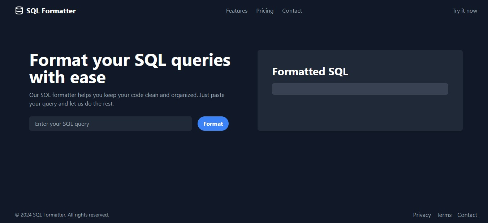
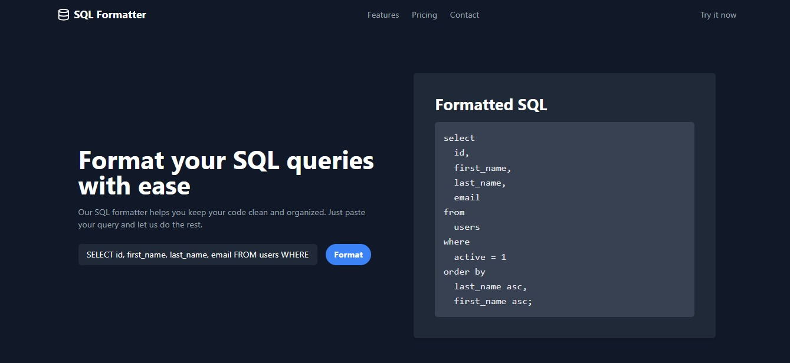

# SQL Query Formatter 📋


## Introduction 📋

SQL Query Formatter is an application designed to help you format and improve the readability of your SQL queries. With an intuitive interface and powerful features, this tool is essential for developers and data analysts looking to optimize their workflow with SQL. 🛠️

## Technologies Used 💻

The app is built using the following technologies:

- **NestJS:** A progressive Node.js framework for building efficient, scalable server-side applications.
- **React:** A JavaScript library for building user interfaces.
- **TypeScript:** A programming language that builds on JavaScript by adding static type definitions.

## Features 🌟

- **SQL Formatting:** Enhance the readability of your SQL queries with a single click.
- **Intuitive Interface:** A user-friendly interface that makes working with SQL queries easy.

## 📸 Screenshots

Here are some visual examples of our project in action:

### Home Without query


### Home with query


## Getting Started 🚀

To get a local copy up and running, follow these simple steps.

### Prerequisites 📋

- Node.js
- npm (Node Package Manager)

### How to Run the Application 🚀

```bash
# Clone the repository
git clone https://github.com/Andrewsy1004/SQL-Query-Formatter.git

# Start Backend
cd backend
npm install
npm run start

# Start Frontend
cd frontend
npm install
npm run start
